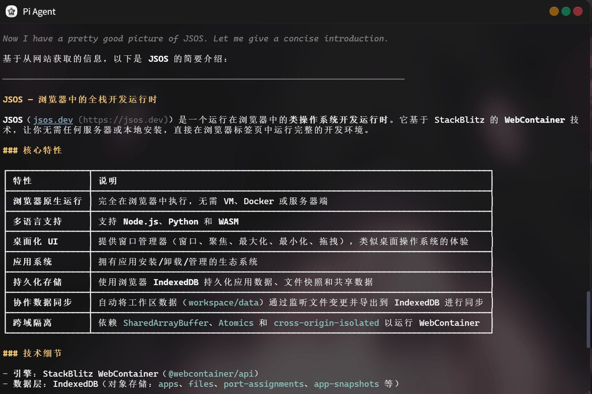

# PI Agent
> for JSOS: https://jsos.dev

## 介绍
在浏览器中运行PI-Agent

PI仓库: https://github.com/earendil-works/pi

## 安装
1. 打开 [JSOS](https://jsos.dev)
2. 右键桌面->安装应用->Github安装
3. 粘贴该项目地址，安装

> 第一次打开应用，会先安装依赖，稍等一会即可。 后续再启动将会跳过已安装依赖，更快加载。

## 截图

## 说明
pi基于ts编写，所以可以通过[JSOS](https://jsos.dev)平台，运行在浏览器端，但官方的源码有一些写法并不适配JSOS所使用的NodeJS版本（v22.22.3），所以`cli.sh`里有一个修复代码的操作。

`.pi/`配置目录存储在`$DATA_DIR/.pi/`中，你的登录信息/配置/插件等数据推荐都存储在这个目录，这样JSOS网页刷新了之后还能继续使用。

PI官方原版更新频繁，为了避免更新后导致现有的“补丁”失效，所以我们在`package.json`中固定了pi的版本

## 适配工作
1. `node_modules/@earendil-works/pi-coding-agent/dist/core/sdk.js`文件中的`export *`语法在`Webcontainer`环境（nodejs v22.22.3）不适用，遂更新为：`export { AgentSessionRuntime, createAgentSessionFromServices, createAgentSessionRuntime, createAgentSessionServices } from "./agent-session-runtime.js";`

2. fd工具（https://github.com/sharkdp/fd），使用nodejs重写了：https://github.com/jsos-dev/node-fd

3. ripgrep工具（https://github.com/BurntSushi/ripgrep）：编译为了`wasm`，并在webcontainer中成功使用`wasm --mapdir /:/ rg.wasm -- -arg value`执行
